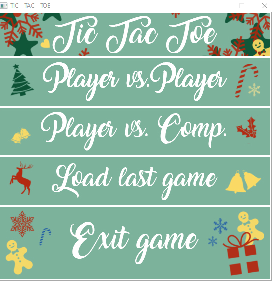
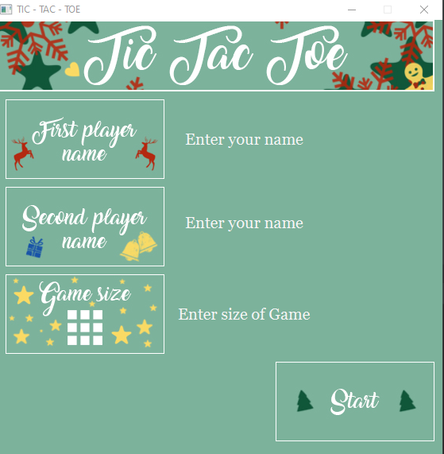
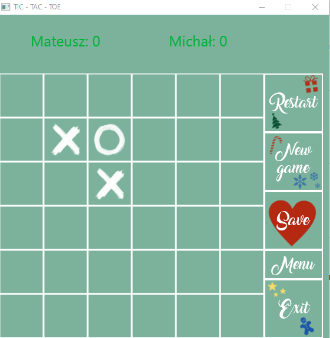

# SUDOKU CONSOLE GAME

## Table of contents
* [Introduction](##Introduction)
* [Screenshots](##Screenshots)
* [Technology](##Technology)
* [How to start up an application](##HowToStartUpAnApplication)

## Introduction
###Tic-Tac-Toe is a simple game - everyone knows what game I'm talking about :) 

## Screenshots
You have an option to make a choice between play with your friend or with a computer player.

After you pick a type of game, you can pick your name, also you can set a game size:)

In the game you can:
* restart a game - points stay
* create a new game - points restart
* save a game 
* exit to menu
* exit to desktop

## Technology
- Java 8
- JUnit
- Gradle
- JavaFX

## How to start up an application
* Just download a repository and click on TicTacToeStart.jar file which is located in main folder. 
